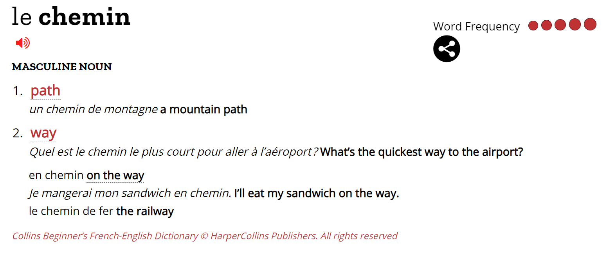
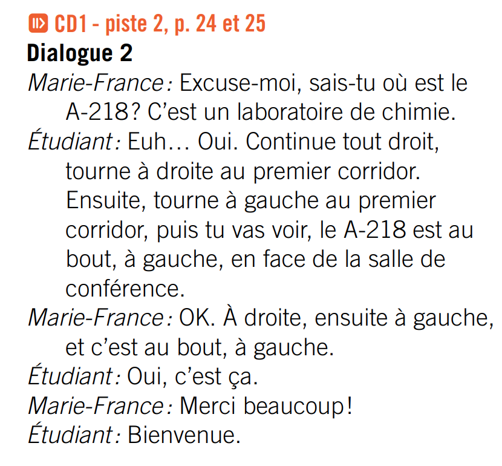
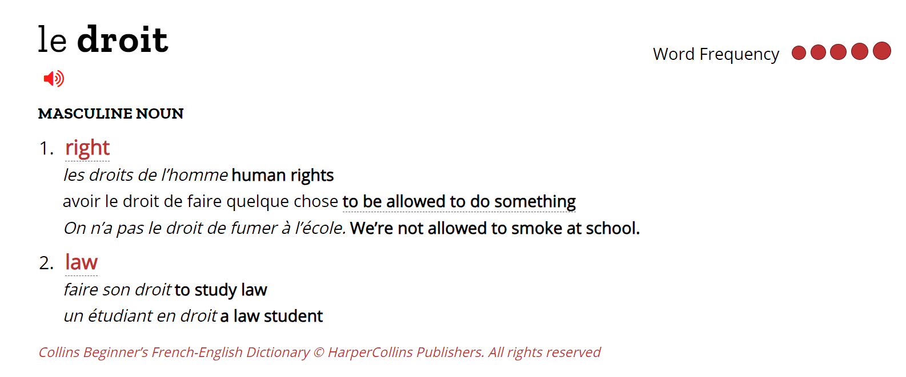
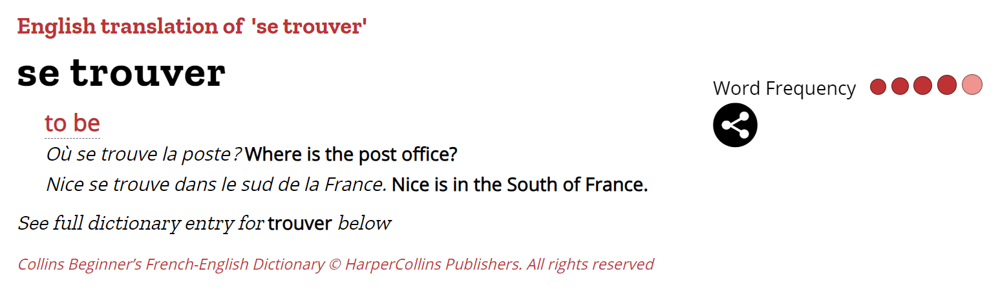
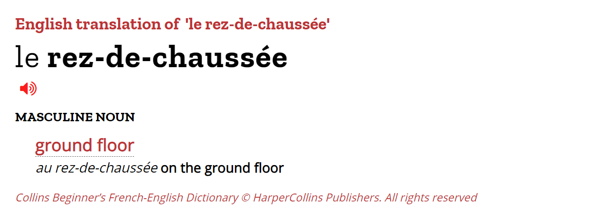

le chemin  
  

**endroit**: place  
*C’est un endroit très tranquille*. It’s a very quiet place.   

**le sous-sol**: basement  

  
*tout droit*: straight on  
tourne/tournez à droite: turn right  
tourne/tournez à gauche: turn left  
au bout  
à gauche  
en face de  

  

aborder, remercier et répondre à des remerciements    

**se trouve**:  
  

le concierge: 门卫，看门人  
la garderie: 托儿所， 幼儿园  

  

le clavier: 键盘  
la souris d'ordinateur: 鼠标  
l'écran: 屏幕  
le pot à crayons 
l'étagère: the shelf  
*Il s'assoit sur/entre un banc.* He sits on a bench.     
