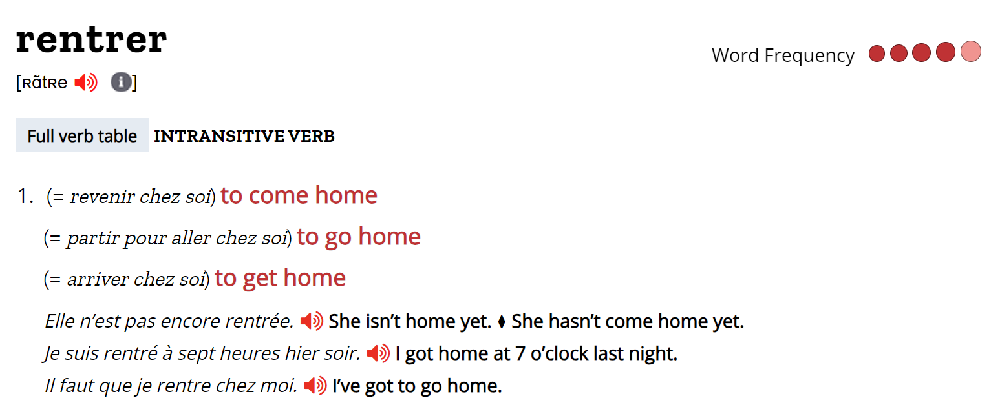
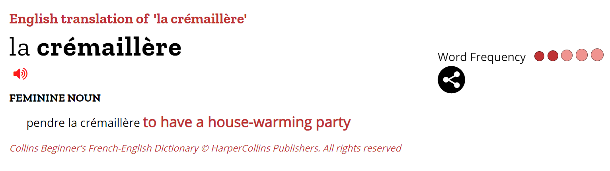
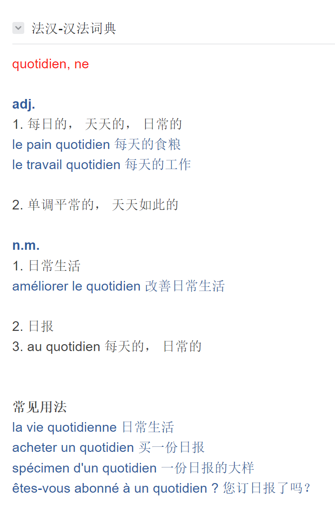
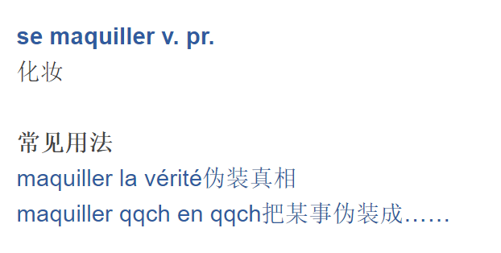

je fais un peu de ménage.  
    - le ménage: housework  

Le soir, je rentre chez moi.  
  

Oui, rien de spécial.  

coloc = colocataire  
mon coloc et moi, on *pend* notre crémaillère *dans* deux semaines.   
  

Dire ce que l'on fait au **quotidien**.  
  

allumer la radio: 打开收音机  
Elle se mouche. 她擦了擦鼻涕。  
je me maquille.  
  

