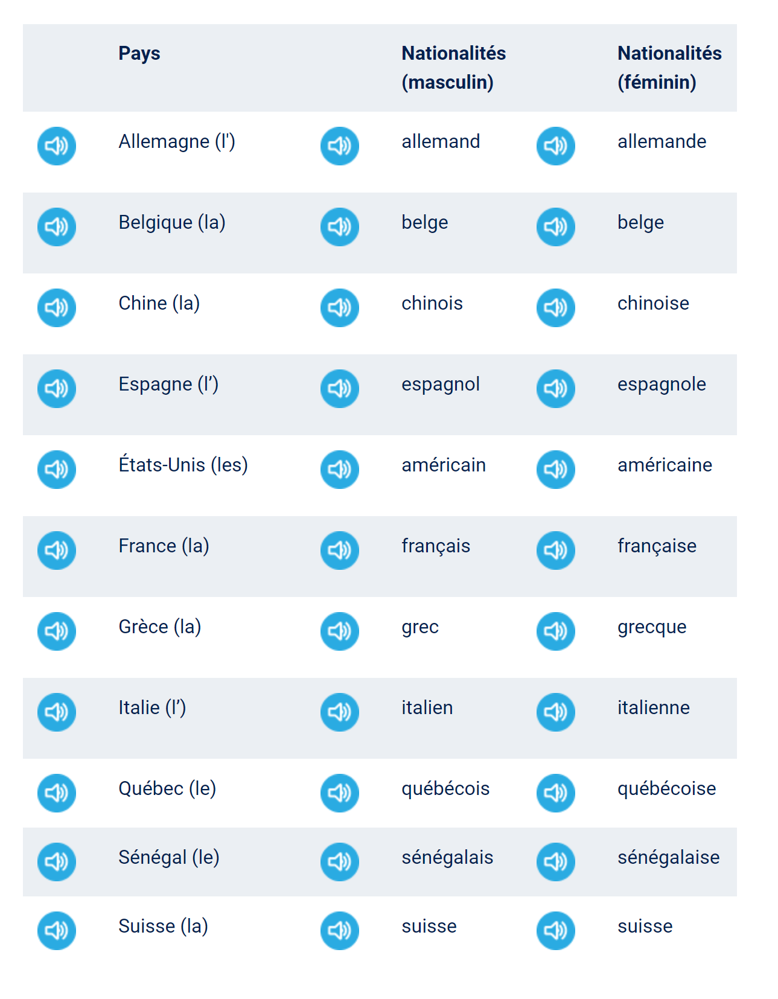

# Unité 3 La vie quotidienne
## Vocabulaire
1. La famille  
le mari, la femme  
le fils, la fille = les enfants  
2. Parler d'une personne  
accueillant, accueillante 殷勤的， 好客的  
affectueux, euse 亲热的, 热爱的, 深情的, 多情的  
agréable 可爱的， 讨人喜欢的  
amical, ale; pl.~aux. une visite amicale 友好访问  
poli, e: enfant poli 有礼貌的孩子  
charmant, e: adj. 迷人的, 富于诱惑力的  
Elle est charmante. 她很迷人  
3. mauvais, e: une mauvaise idée 
4. Il voyage en Patagonie! 巴塔哥尼亚(地区)[阿根廷]  

## Pays, nationalités
  
